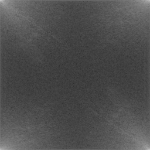
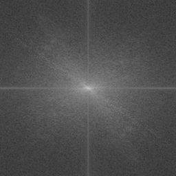

# FunFFT

** Purpose

This program allows you to visualize FFT in raw and centered image. Although these functions are 
available in Matlab, Mathematica, and various commercial software, but I could not find any
open-source. Hoepfully, it will help students to learn FFT.

## Examples

  

